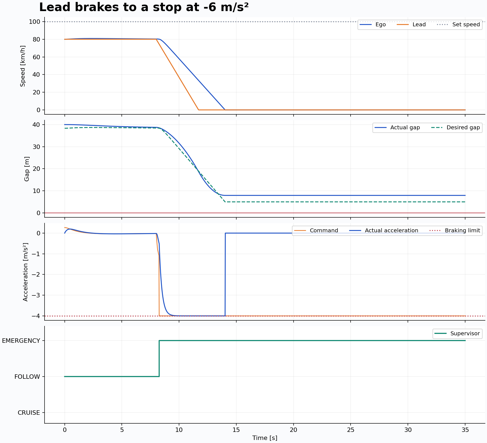
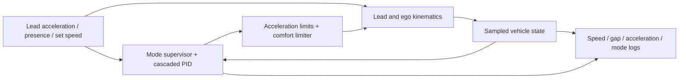
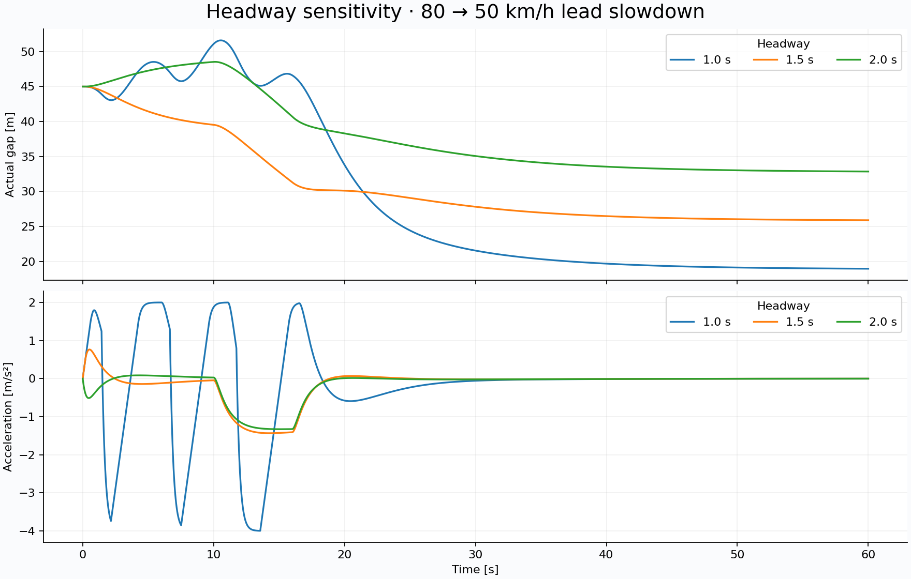

# Adaptive Cruise Control & Emergency Braking

[](https://github.com/tanishy7777/adaptive-cruise-control/actions/workflows/validate.yml)

A reproducible automotive control project in **MATLAB and Simulink**, with a Python reference implementation. An ego vehicle tracks a driver-set speed, follows a slower lead vehicle using a time-headway policy, and applies emergency braking when a stopping-distance or time-to-collision threshold is crossed.

The project includes a **generated, editable Simulink model**, six driving scenarios, P/PI/PID and headway comparisons, raw time-series data, plots, and automated behavioral and cross-implementation checks. The plant is a one-dimensional kinematic model with actuator lag; this is an educational simulation, not production ADAS software.

[Download the complete v1.0.0 bundle](https://github.com/tanishy7777/adaptive-cruise-control/releases/tag/v1.0.0), including the verified model and MATLAB/Simulink outputs.



## Run it

### MATLAB

From the repository root, in MATLAB:

```matlab
addpath('matlab');
run_project;       % Six scenarios, MATLAB plots/CSVs, headway and PID studies
test_project;      % Behavior checks and comparison with Python traces
```

Requires MATLAB; the numerical simulation does not require additional toolboxes. The CI target is **R2024b**.

### Simulink

With MATLAB + Simulink, open the included **R2024b model** directly:

```matlab
addpath('matlab');
open_system('models/acc_aeb.slx');
```

Or rebuild it from the source and run the complete suite:

```matlab
addpath('matlab');
build_simulink_model;       % Creates models/acc_aeb.slx
open_system('acc_aeb');    % Default: 80 -> 50 km/h lead slowdown
run_simulink;              % All six scenarios; assert agreement with MATLAB
```

The model contains a scenario source, supervisor/PID MATLAB Function block, separate vehicle dynamics block, explicit state delays, a scope, and logged measurements. The MATLAB Function blocks call the same controller and plant functions as the numerical simulation. No Automated Driving, MPC, or Control System Toolbox is needed. The supervisor is written as explicit mode logic; it is not a graphical Stateflow chart.

The checked-in [`models/acc_aeb.slx`](models/acc_aeb.slx) was generated by a successful R2024b CI run. Each successful [CI run](https://github.com/tanishy7777/adaptive-cruise-control/actions) also uploads **`matlab-simulink-results`**, containing the model, MATLAB plots/CSVs, and Simulink traces. Rebuild after changing source/configuration. [Validation record →](docs/VALIDATION.md)

### Python reference

Python 3.9–3.12:

```bash
python3 -m venv .venv
source .venv/bin/activate       # Windows: .venv\Scripts\activate
python -m pip install -r requirements.txt
python -m unittest discover -s tests -v
python python/run_experiments.py
```

This regenerates the checked-in `results/` without MATLAB. MATLAB outputs go to `results/matlab/`, keeping their provenance distinct. Configuration lives in [`config/parameters.json`](config/parameters.json) and [`config/scenarios.json`](config/scenarios.json).

## How it works



The target bumper-to-bumper gap is

$$d_{\mathrm{desired}} = d_0 + T_h v_{\mathrm{ego}}.$$

In **CRUISE**, the speed reference is the driver's set speed. In **FOLLOW**, a proportional outer gap loop creates a bounded speed reference:

$$v_{\mathrm{ref}} = \operatorname{clip}\big(v_{\mathrm{lead}} + K_g(d-d_{\mathrm{desired}}),\,0,\,v_{\mathrm{set}}\big).$$

A discrete PID acts on $e=v_{\mathrm{ref}}-v_{\mathrm{ego}}$. Its derivative is low-pass filtered. Conditional integration prevents windup against both the acceleration saturation and comfort limiter. Mode changes reset integral and derivative memory. Predictive entry thresholds and hysteresis engage FOLLOW before the braking envelope is reached.

**EMERGENCY_BRAKE** overrides the PID with −4 m/s² when the gap is critical, TTC is small, or the stopping envelope is crossed while closing. A conservative lead braking assumption of 6 m/s² is used. Emergency braking bypasses the comfort limiter; the actuator still has a 0.25 s lag. A standstill latch keeps the brake applied behind a stopped lead vehicle.

See [the control design](docs/DESIGN.md) for equations, sample ordering, exact switching rules, and assumptions.

## Scenarios and measured results

Baseline: 20 ms sample time, 1.5 s headway, 5 m standstill gap, +2/−4 m/s² command limits.

| Scenario | Minimum gap | Speed settling time¹ | Emergency active |
|---|---:|---:|---:|
| Free road: 54 → 100 km/h | N/A | 7.08 s | No |
| Follow an 80 km/h lead | 38.36 m | 10.40 s | No |
| Lead slows 80 → 50 km/h | 25.90 m | 0.92 s | No |
| Lead brakes at −6 m/s² | 7.93 m | 1.90 s | Yes |
| Catch a 60 km/h lead | 30.02 m | 19.82 s | No |
| Lead leaves lane at 25 s | 30.55 m² | 6.22 s | No |

¹ Time after the configured event endpoint until speed enters and remains within ±0.5 m/s of the final target for at least the last 5 s. For the slowdown, the clock starts at 16 s; for hard braking, at 12 s. These are speed metrics, not gap settling times. ² Only while the lead is present.

**No collisions occur in the six baseline simulations.** That does not mean the target gap is always preserved: hard braking briefly drops 1.57 m below the time-headway target. Free-road set-speed overshoot is 1.08 km/h. The deliberately infeasible 6 m gap / 90 km/h approach registers a collision at 0.26 s.

The 1.0 s headway comparison produces repeated AEB interventions and does not settle in two cases. This exposes a conflict between the aggressive gap target and the conservative stopping envelope. PID is also not uniformly better than P or PI: P has lower following-gap RMSE in the slowdown experiment, while PI settles speed faster. [Full results and interpretation →](docs/RESULTS.md)



## Verification

- Python tests cover the 18 headway/scenario combinations, physical bounds, stopping kinematics, anti-windup, mode hysteresis, emergency braking, return to cruise, infeasible collision detection, and 20 ms versus 10 ms integration.
- MATLAB checks all 18 combinations and compares all six baseline traces with Python.
- Simulink executes all six scenarios and compares every sampled output with MATLAB.
- GitHub Actions regenerates results and retains the model and output artifacts. A green badge means both jobs succeeded; see the run logs for the actual execution status.

Committed figures and numbers are generated by Python. **MATLAB and Simulink validation passed on 3 October 2026:** all six Simulink traces matched MATLAB with zero maximum difference in the first ten logged columns. [Successful run and tolerances →](docs/VALIDATION.md)

## Repository guide

| Location | Purpose |
|---|---|
| `matlab/acc_controller.m` | Supervisor, outer gap loop, filtered PID, anti-windup |
| `matlab/acc_plant.m` | First-order actuator and non-reversing vehicle dynamics |
| `matlab/build_simulink_model.m` | Editable model builder |
| `matlab/run_project.m`, `run_simulink.m` | MATLAB and Simulink experiments |
| `python/` | Independently translated reference and report generation |
| `config/` | Shared parameters and lead-vehicle profiles |
| `tests/` | Python behavioral checks |
| `results/traces/` | Baseline sample-by-sample CSV data, SI units |
| `results/*metrics.csv` | Baseline, headway, and controller comparison tables |
| `docs/` | Design, results, and demonstration notes |

## Scope and next steps

Perfect range/speed sensing, a straight flat road, fixed acceleration authority, no aerodynamic drag, and no tire/road friction model are assumed. There is no perception, cut-in tracking, driver takeover logic, sensor noise, or hardware validation. AEB thresholds are engineering heuristics, not a formal safety guarantee. After a detected collision, kinematic traces continue for diagnosis; no impact dynamics are modeled.

Useful extensions are noisy/delayed sensors, varying available braking, smoother standstill dynamics, and a predictive controller that jointly respects following distance and comfort. [Demo and interview guide →](docs/DEMO.md)

## References

- [MathWorks ACC example](https://www.mathworks.com/help/mpc/ug/adaptive-cruise-control-using-model-predictive-controller.html): longitudinal ACC problem and time-gap formulation. This project implements PID, not that example's MPC algorithm.
- [Programmatic Simulink model construction](https://www.mathworks.com/help/simulink/ug/add-copy-replace-and-delete-blocks-programmatically.html).
- [MATLAB Function block API](https://www.mathworks.com/help/simulink/slref/stateflow.emchart.html).
- [MATLAB GitHub Actions](https://github.com/matlab-actions/setup-matlab).

MIT licensed. Independent educational project; no affiliation with Suzuki or MathWorks.
