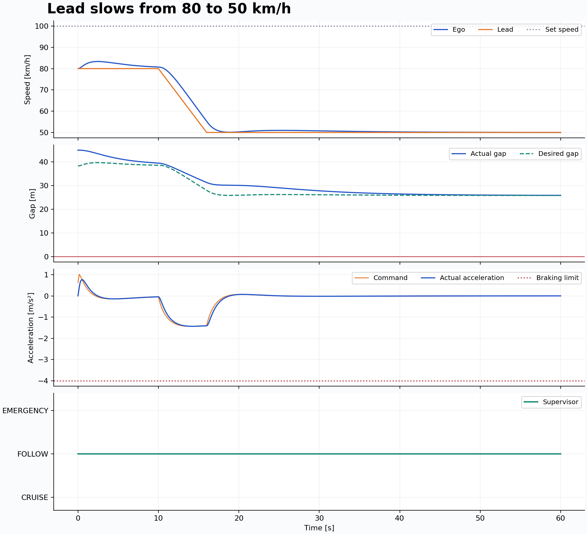
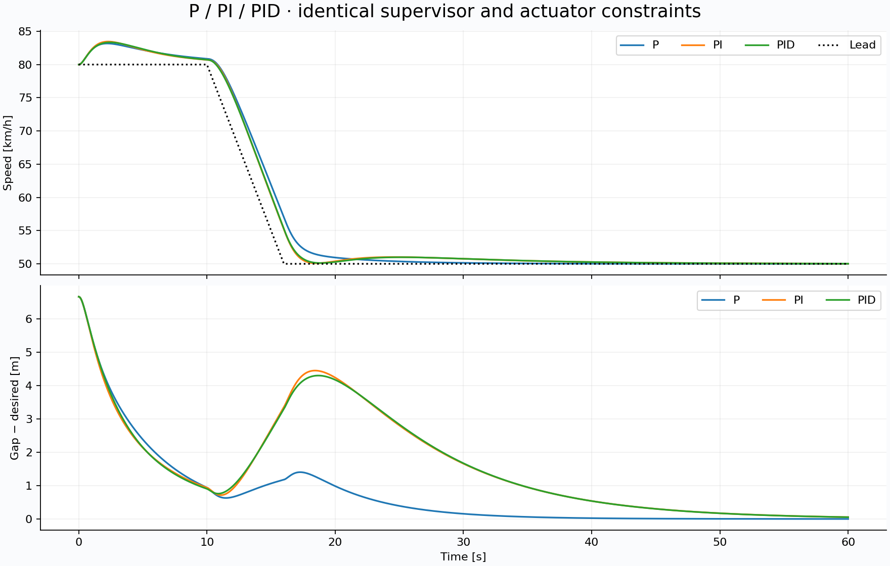

# Experiment report

These numbers come from `python/run_experiments.py`, with the committed JSON configuration. Raw data, metrics, and figures are in `results/`. MATLAB reproduces the experiment in `results/matlab/`; GitHub Actions checks trace agreement and uploads those outputs.

## Baseline

The six baseline scenarios complete without bumper overlap. Commands and realized acceleration stay within +2/−4 m/s². The free-road vehicle reaches a ±0.5 m/s band around 100 km/h in 7.08 s, with 1.08 km/h peak overshoot. When the lead leaves at 25 s, the vehicle returns to that band in 6.22 s.

In the 80→50 km/h slowdown, the lead decelerates at 1.389 m/s² from 10 through 16 s. Ego speed settles 0.92 s after 16 s. Following-gap RMSE over FOLLOW samples is 2.20 m; the minimum actual gap is 25.90 m. The error approaches zero by the end of the run.

In the hard-brake case, the lead starts braking at 8 s at −6 m/s², stronger than the ego's available −4 m/s². AEB activates at 8.26 s; the ego stops with 7.93 m clearance. The actual gap spends 1.78 s below the desired time-headway gap, reaching a −1.57 m gap margin. **Avoiding a collision and preserving the desired gap are different outcomes.** Emergency mode remains latched at standstill, so the 26.74 s emergency duration includes stationary brake holding.

The plot's acceleration returns from approximately −4 to zero at standstill. This hard kinematic constraint yields a 200 m/s³ discrete peak jerk at a 20 ms step. It is a model discontinuity, not a claim about achievable passenger comfort. Raw jerk metrics include this point; emergency operation also bypasses the 2.5 m/s³ comfort limit. Free cruise and ordinary following satisfy the moving-vehicle comfort bound.

## Headway study

Each headway runs the same six scenarios from the **same physical initial conditions**. Thus a larger target gap may already be violated at time zero; the study is not an equilibrium-to-equilibrium comparison.

| Headway | Slowdown min gap | Slowdown gap RMSE | Slowdown speed settling | Slowdown AEB duration |
|---|---:|---:|---:|---:|
| 1.0 s | 18.97 m | 11.96 m | 11.90 s | 3.40 s |
| 1.5 s | 25.90 m | 2.20 m | 0.92 s | 0.00 s |
| 2.0 s | 32.86 m | 2.24 m | 1.62 s | 0.00 s |

All 18 runs avoid collision, but 1.0 s headway performs poorly. In steady following and catching the slower lead, it cycles between acceleration and AEB and does not settle within the experiment. At 80 km/h the 1.0 s target is 27.22 m, while the stopping envelope plus the entry margin is about 33.13 m. The desired following policy conflicts with the conservative AEB trigger as soon as the ego starts closing. The baseline 1.5 s is retained for this reason; collision avoidance alone would be an inadequate acceptance criterion.

At 2.0 s, the slowdown starts with 45 m actual gap and 49.44 m desired gap. Its reported negative gap margin includes that initial condition. Larger headway is not automatically a lower RMSE under fixed starting geometry.

## P vs PI vs PID

All three use the same gap loop, state machine, plant, and saturation. Only the inner speed controller's integral/derivative gains change. This is a fixed-gain ablation, not separate optimal tuning of each controller.

| Controller | Slowdown gap RMSE | Speed settling after 16 s | RMS jerk |
|---|---:|---:|---:|
| P | 1.42 m | 1.96 s | 0.242 m/s³ |
| PI | 2.20 m | 0.84 s | 0.255 m/s³ |
| PID | 2.20 m | 0.92 s | 0.249 m/s³ |

P provides the smallest gap RMSE and smoothest response in this scenario. PI/PID settle speed faster. The filtered derivative slightly reduces RMS jerk relative to PI, but does not improve every metric. With a simple acceleration-driven plant and no constant load disturbance, there is no basis to claim that integral action is always necessary for zero final speed error.

## Metric definitions

- **Minimum gap:** minimum actual gap only while a lead is detected; absent-lead cases are blank/null.
- **Gap margin:** actual minus desired gap. A negative value is a policy violation, not necessarily a collision.
- **Gap RMSE:** measured over FOLLOW samples only, excluding CRUISE and AEB. Mode-dependent sampling means this metric should be considered alongside AEB duration and mode transitions.
- **Speed settling:** earliest sample after `settle_after` for which every remaining speed sample stays within ±0.5 m/s of `final_speed`, with at least 5 s remaining. Blank/null means it did not meet that criterion. This is an absolute tolerance, not a 2% settling band.
- **Overshoot:** maximum excess above the driver's set speed, in km/h; it does not measure overshoot relative to a changing lead speed.
- **Jerk:** first difference of realized acceleration divided by sample time, including emergency and standstill transitions.
- **Durations:** count qualifying intervals; the terminal sample adds no duration. Mode-transition counts exclude the initial state assignment.
- **Collision:** detected lead and gap ≤0. First collision is the first qualifying sample; temporal precision is limited to the sample period.

## Deliberate failure case

At 90 km/h with a stationary obstacle only 6 m ahead, even instantaneous 4 m/s² braking needs 78.125 m before adding actuator lag. The controller immediately commands emergency braking, yet registers collision at 0.26 s. `results/limitation.json` records this failure. Negative gap after impact is diagnostic overlap from continuing the kinematic equations; it has no crash-physics interpretation.

## Validation provenance

Local execution uses Python. CI has separate Python and MATLAB/Simulink jobs. The MATLAB job runs behavioral tests, compares the Python/MATLAB traces, generates MATLAB plots, builds the `.slx`, simulates every baseline scenario, and compares Simulink/MATLAB traces. Check the linked GitHub run for completion and download its artifacts for evidence. No hardware, road testing, sensor validation, or formal stability proof is claimed.
